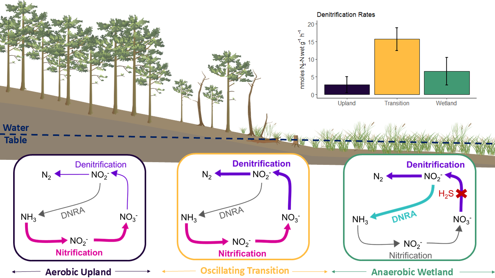

# Nitrate reduction across soils transitioning from coastal forest to wetland are hotspots for denitrification:

This GitHub page hosts the data and code for the COMPASS-FME (https://compass.pnnl.gov/) Chesapeake Bay Synoptic Site N Cycle Experiment conducted in 2022. All code and data can be found on this Github page. 

**Graphical abstract from Wilson et al., (2025):** 

**Experimental Design & Informtaion:**

Soils were collected from around the Chesapeake Bay to assess denitrification and DNRA rates across the terrestrial aquatic interface 

**Some photos from the experimental process: **

